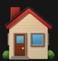

## Hi there, I'm Sherry Bath

### Introduction

- 🌱 `I'm a QA Lead, Content Writer and a Technology Enthusiast.`
- 🎯 `I am passionate about working with APIs and its documentation.`
- 🥅 `I love exploring new things in technology.`
- ⚡ `I love hiking and cooking.`
- 📕 `I strive to boost organizational growth with my technical/writing skills.`

### Technology Stack:

- 💡 `User Guides, Developer Documentation, Release Notes, How-To's`
- 💡 `API Documentation, SDKs, SOPs, Reports, Manuals`
- 💡 `SoapUI, Postman, Rest API, Swagger, Open API`
- 💡 `AWS Technologies - EC2, S3, CloudWatch, Data Lake, Athena`
- 💡 `Azure Technologies - Azure Service Bus, Data Lake, Active Directory`
- 💡 `Big Data Technologies - Kafka, Elastic Search, YARN`
- 💡 `JavaScript, NodeJS, C#, Git, VSCode, Cypress, Gherkin`
- 💡 `JSON, XML, CSV, HTML, CSS, PDF, DITA, Markdown`
- 💡 `Visio, SnagIT, Figma, Confluence, Oxygen, RoboHelp`
- 💡 `Methodologies - Agile, Scrum, Kanban`

### Certifications

- ✅ `AWS Certified Cloud Practitioner`
- ✅ `Microsoft Certified Azure Fundamentals `
- ✅ `International Standards for Testing and Quality`
- ✅ `Agile SAFE Practitioner`

### Connect with me

[][linkedin]

 
 

[linkedin]: https://www.linkedin.com/in/sherrybath/
